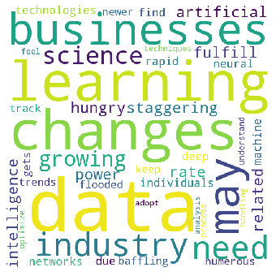

# NLP and WordCloud

In this repo. I'm using NLP to create Word Cloud.

## File Description
~~~~~~~
        NLP-and-WordCloud
          |-- NLP-Notebook
          |-- README
~~~~~~~
## Installation
Must runing with Python 3 with libraries of nltk, matplotlib, ngrams and wordcloud libraries.

## File Descriptions
1. NLP-Notebook file including all the code you can and using jupyter Notebook.
2. README file

## Instructions
1. Run the following commands in the project's root directory to set up.

    - To run Jupyter Notebook in cmd prompt 
        `jupyter notebook`
    - To run cell(s) present in Notebook 
        `press Shift + Enter key to execute or select from menu Cells -> Run cell `

### General Notes

For Regular Updates [Follow me](https://github.com/vijaypurohit322/).
